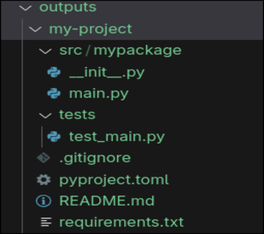
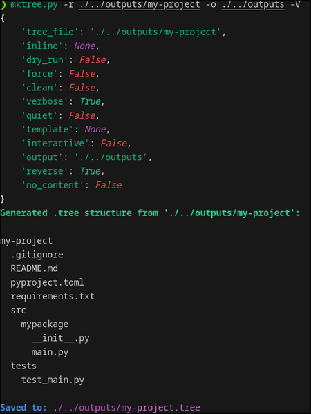

# 📂 mktree

**mktree** is a Python CLI tool designed to **simplify the creation and management of folder and file structures** using a clean, human-readable `.tree` format or inline string.  
Rather than inspecting what already exists on your system, it works in reverse: you define the structure you want, and **mktree generates it for you automatically**.  

Whether you’re setting up a new project, creating reusable templates, or automating repetitive folder and file setups, **mktree** saves time and keeps your workflow consistent.  
It supports inline file contents, multiline blocks, and even safe previews before writing anything to disk. With features like dry-run mode, template support, and reverse generation from existing directories, it’s ideal for developers, designers, and anyone who frequently works with structured files and directories.

---

## ✨ Features

- **Parse `.tree` files** with simple indentation-based syntax.  
- **Inline mode** (`--inline`) for quick one-off structures.  
- **Template support** (`--template`) for reusable project skeletons.  
- **Reverse mode** (`--reverse`) to generate a `.tree` file from an existing directory.  
- **Rich preview**: renders a colored tree structure before applying changes.  
- **Dry-run mode** (`--dry-run`) to check output without writing to disk.  
- **Safe by default**: asks for confirmation unless `--dry-run` is used ,won't overwrite unless `--force` is provided.  
- **Optional file contents**:
  - Inline (`file.txt: hello world`)
  - Multiline blocks (`file.py:|` … indented content …)  
- **Binary-aware reverse**: detects binaries and skips or replaces content with `<binary file>`.  
- **Configurable verbosity**: `--verbose` or `--quiet` modes.  
- **`.mktreeignore` support**: ignore files or directories when using --reverse to generate a `.tree` file.

---

## 🖼️ Screenshots

### Using .tree file

<p float="left">
  
  
</p>

### Using template

<p float="left">
  
  
</p>

### Reverse mode



---

## 📦 Installation

Clone the repo and install dependencies:

```bash
git clone https://github.com/BehrazFS/mktree.git
cd mktree
uv sync   # or pip install -r requirements.txt
```

Make the `mktree.py` executable:

```bash
chmod +x mktree.py
```
To make mktree available system-wide, add the following line to your `.zshrc` or `.bashrc` file:
```
alias mktree='absolute_path_to_mktree/mktree/src/mktree.py'
```

This lets you run `mktree` from anywhere without specifying its full path. After adding the alias, reload your shell with:
```bash
source ~/.zshrc   # or source ~/.bashrc
```
> The project is set up with [uv](https://github.com/astral-sh/uv) and creates a local `.venv` automatically.

---

## 🚀 Usage

### 1. Create a `.tree` file

Example: `project.tree`

```
my_project
  src
    main.py:|
      print("Hello, mktree!")
  README.md: My new project
```
comments (starting with `#`) are ignored

### 2. Generate structure

```bash
python -m mktree project.tree --output ./outdir
```

### 3. Inline usage

```bash
python -m mktree --inline "test.txt: some content"
```

### 4. Templates

Put `.tree` files into the `templates/` folder. Example: `templates/python-package.tree`.

```bash
python -m mktree --template python-package --output ./myproj
```

### 5. Reverse existing directory

```bash
python -m mktree my_project --reverse --no-content
```

This generates `my_project.tree` describing the structure. <br>
Binary files are skipped or marked as <binary file> in the .tree output.

**`.mktreeignore` Support**

You can define files or directories to **ignore** when generating a `.tree` file from an existing directory.  

Create a `.mktreeignore` file in the **root of your project**, with each line specifying a pattern (supports `*` wildcards):

**Example `.mktreeignore`:**
```
cache
temp.txt
# comment
*.log
```
- mktree will skip all files or directories matching patterns in `.mktreeignore`.
- Wildcards are supported (e.g., *.log).
- Ignored entries are logged only in verbose mode (--verbose).
- only one pattern per line is allowed in `.mktreeignore` file.

---

## ⚙️ CLI Options

| Flag / Arg        | Description |
|-------------------|-------------|
| `tree_file`       | Positional arg: path to `.tree` file OR directory (with `--reverse`) |
| `-i, --inline`    | Inline tree structure as a string |
| `-t, --template`  | Use a template from `templates/` |
| `-o, --output`    | Base directory for creation (default: `.`) |
| `-d, --dry-run`   | Preview without creating anything |
| `-f, --force`     | Overwrite existing files/directories |
| `-r, --reverse`   | Generate `.tree` file from an existing directory |
| `-n, --no-content`| In reverse mode, omit file contents |
| `-c, --clean`     | (Not yet implemented) Remove generated tree |
| `-I, --interactive` | (Coming soon) Interactive mode |
| `-V, --verbose`   | Verbose output |
| `-q, --quiet`     | Quiet mode (minimal output) |
| `-v, --version`   | Show version info |
| `-b, --binary`    | (Not yet implemented) In reverse mode Include small binary files |
| `-l, --no-limit`  | Do not truncate text file contents |

---

## 📂 Example Tree Syntax

```
project
  src
    # multiline content
    main.py:|      
      print("Hello")
      print("World")
  LICENSE: MIT
  docs
    intro.md: this is intro
    # Intro
```

- `name/` → directory  
- `name.ext` → file  
- `file.txt: content` → inline file content  
- `file.py:|` → multiline content until dedent  

---

## 📝 Available templates

- `python-package` : a simple python package structure
- `c++-project` : a simple c++ project structure
> more will be added in the future
---

## 🛠 Development

Run with debug output:

```bash
python -m mktree example.tree --verbose --dry-run
```

---

## 🚧 Roadmap

- [ ] Implement `--clean` (remove generated structure).  
- [ ] Implement `--interactive` mode.  
- [ ] Add more templates.  
- [ ] Implement `--binary` (In reverse mode Include small binary files)

> 💡 Contributions welcome!  
> Found a bug, have a feature idea, or want to add a template? Open an issue or submit a pull request on GitHub — help make **mktree** even better!

---
## 📜 License

This project is licensed under the MIT License. See the [LICENSE](LICENSE) file for details.
